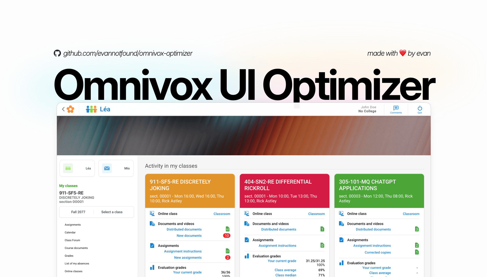
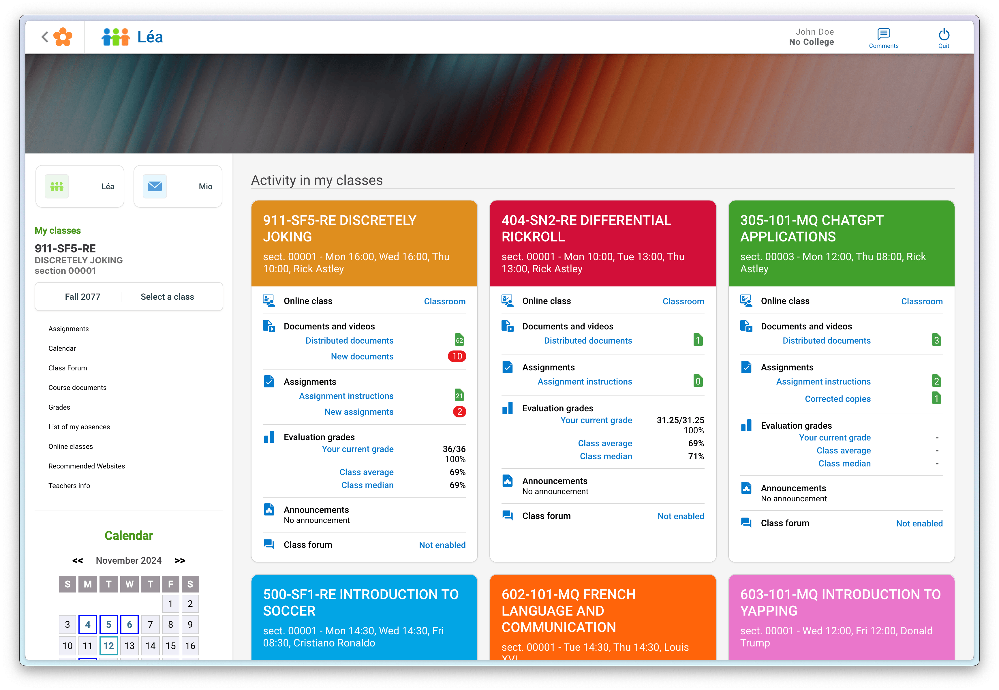
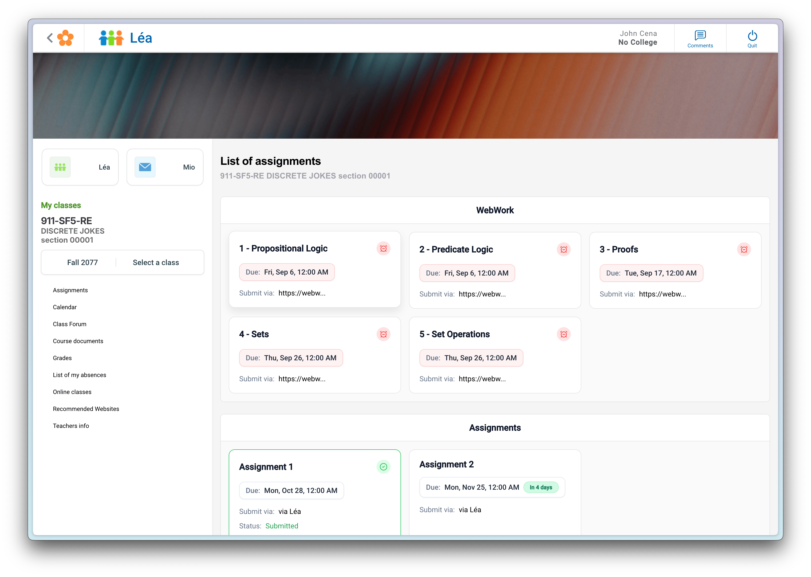
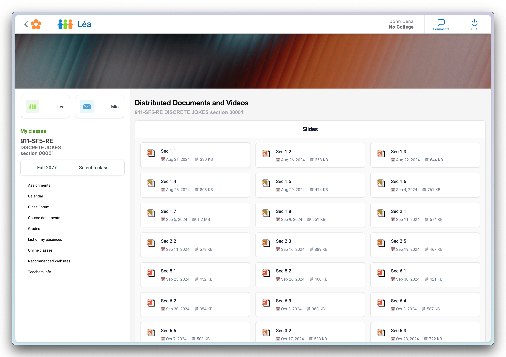

# Omnivox UI Optimizer

A simple user script to improve the UI of Omnivox.

## Installation Guide

1. **Install a UserScript Manager**
   
   **For Chrome/Firefox:**
   - Recommended: Install [Violentmonkey](https://violentmonkey.github.io/) ([Chrome](https://chrome.google.com/webstore/detail/violentmonkey/jinjaccalgkegednnccohejagnlnfdag) / [Firefox](https://addons.mozilla.org/firefox/addon/violentmonkey/))
     - Violentmonkey is recommended because it's open-source, privacy-focused, and fully transparent
   - Alternative: Install [Tampermonkey](https://www.tampermonkey.net/) ([Chrome](https://chrome.google.com/webstore/detail/tampermonkey/dhdgffkkebhmkfjojejmpbldmpobfkfo) / [Firefox](https://addons.mozilla.org/firefox/addon/tampermonkey/))

   **For Safari:**
   - Install [Userscripts](https://apps.apple.com/app/userscripts/id1463298887) from the App Store
   - After installation:
     1. Enable the extension in Safari (Settings > Safari > Extensions)
     2. Set "Allow" permissions for "All Websites" for optimal experience

2. **Install the Script**
   
   **For Chrome/Firefox:**
   - Click [here](https://github.com/evannotfound/omnivox-optimizer/releases/latest/download/omnivox-optimizer.user.js) to install the latest version
   - Your userscript manager will open showing the script details
   - Click the "Install" or "Confirm installation" button

   **For Safari:**
   1. Click [here](https://github.com/evannotfound/omnivox-optimizer/releases/latest/download/omnivox-optimizer.user.js) to access the script
   2. Click the Userscripts extension icon in Safari's toolbar
   3. If prompted, allow Userscripts to access the webpage
   4. Click "Click to install" in the extension popup

3. **Verify Installation**
   - Go to any Omnivox page
   - You should see the improved UI automatically
   - If not, try refreshing the page

## Features
- Modern, clean interface
- Improved navigation
- Better readability
- Custom course colors
- Optimized document viewing
- Optimized assignments viewing

## Screenshots

## License

This project is licensed under the GPL-3.0 license. See the [LICENSE](LICENSE) file for details.

## Contributing

Contributions are welcome! Please see the [CONTRIBUTING.md](CONTRIBUTING.md) file for details.

## Disclaimer

This is an independent, user-created enhancement tool. This project is not affiliated with, endorsed by, or connected to Skytech or any of its products, including Omnivox. The creator(s) of this tool cannot be held liable for any issues that may arise from its use. Skytech and Omnivox are trademarks of their respective owners. Use at your own risk and discretion.